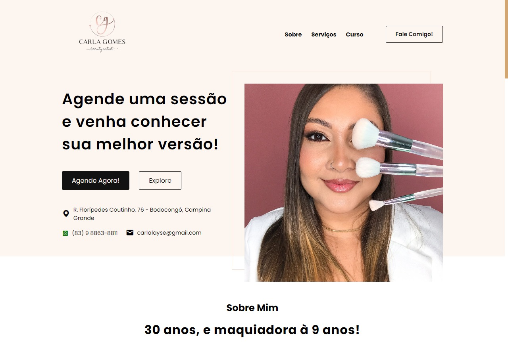

# Portfólio para maquiadora
### Feito em HTML, CSS e JavaScript

Um site feito para a minha prima que é maquiadora. Simples, com o intuito de mostrar o trabalho dela como maquiadora e penteadeira. Site interativo com customizações para combinar com a paleta de cor/Simple, with the intention of showing her work as a makeup artist and hairdresser. Interactive website with customizations to match the color palette

<a href="https://ryanmgf.github.io/carlagomesmakeup/" target="_blank">Clique aqui para testar o projeto</a>

